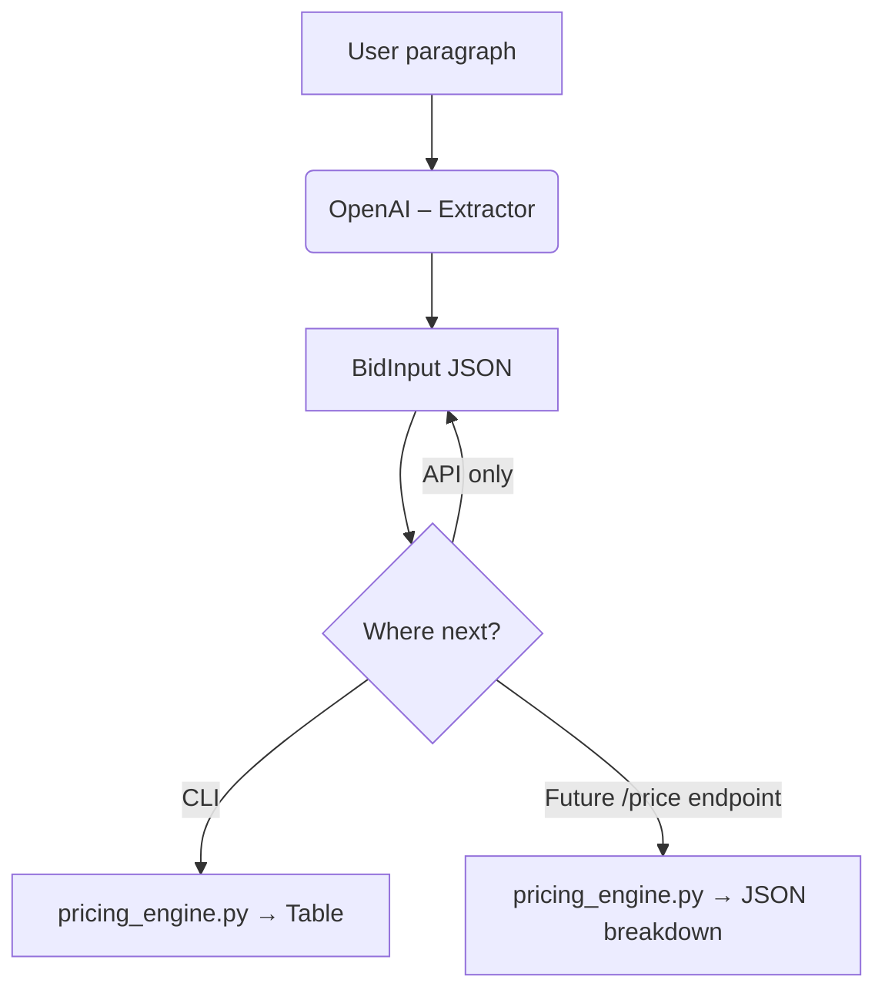

# Bid Estimator – Quick Overview

## What We Built (in plain words)
1. **LLM extraction** – The chatbot reads your messy paragraph (e.g. *"Install 260 jacks, tax 8.25 %…"*) and turns it into a tidy JSON table.
2. **Deterministic math** – Pure Python functions apply your industry formulas to that JSON, so the numbers are always the same.
3. **CLI tool** – Run `python driver.py` to paste text (or `--file my.txt`) and instantly see a line-item cost breakdown.
4. **Streaming option** – Add `--stream` to watch the JSON appear live instead of waiting for the full answer.
5. **FastAPI endpoint** – POST plain text to `/extract` and receive the JSON tokens as they are produced (great for Postman or front-ends).
6. **Virtual environment** – All of this runs inside `.venv` with the few libraries in `requirements.txt`.

## Simple Flowchart

* Blue boxes = code we wrote
* Dashed arrow to **F** = potential future endpoint that combines extract + price in one call.

That's the entire MVP in a nutshell! Feel free to extend any box without touching the others. 